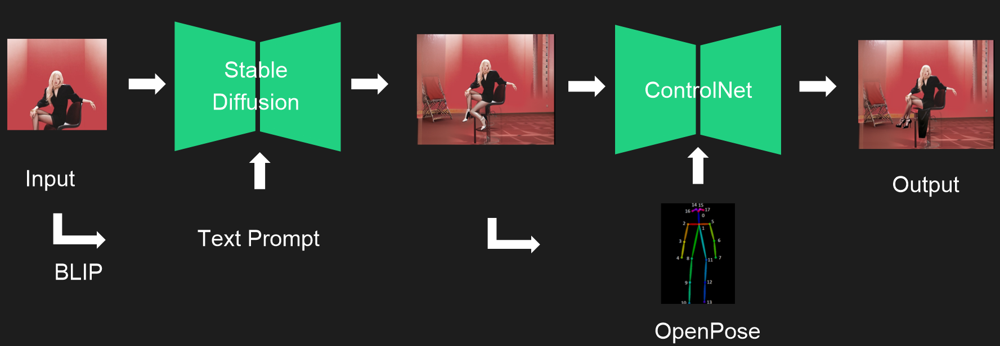
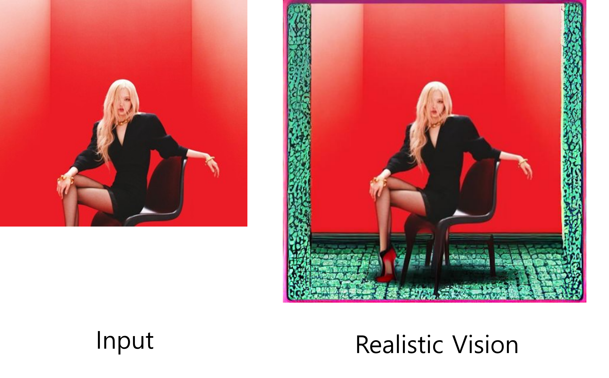
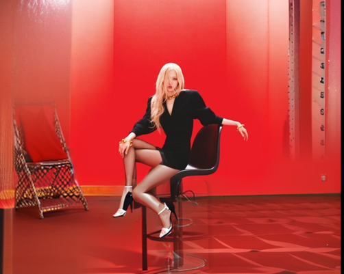
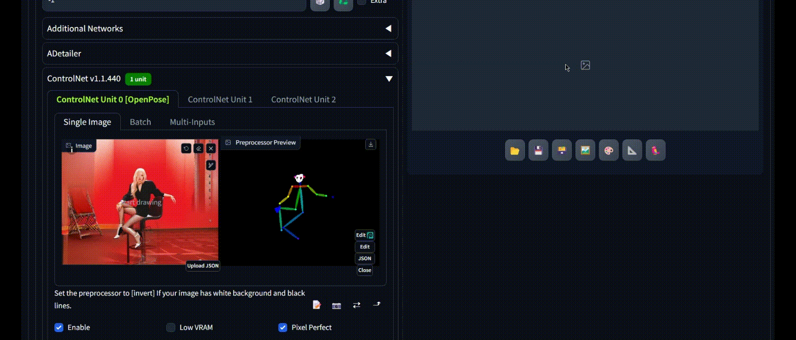
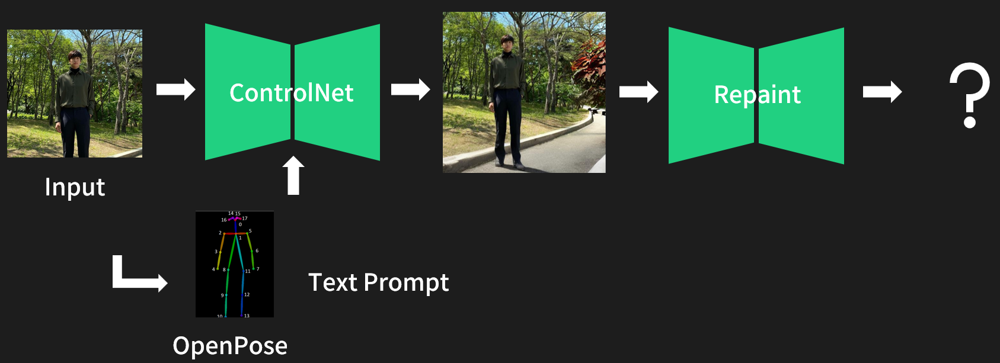

# 디풋젼으로 사진 잘 찍는다고 소문나자

**2024년 겨울 [AIKU](https://github.com/AIKU-Official) 활동으로 진행한 프로젝트입니다.**

**2024년 2학기 AIKU Conference 1등 수상 예정!**

## Abstract

사진에 발끝이 나와야 비율이 좋아 보인다는 암묵적 규칙이 있습니다. 하지만 종종 잘 나온 사진에 발끝이 잘려 아쉬울 때가 있죠. 본 프로젝트는 Diffusion을 이용한 Image Inpainting 을 통해 잘린 이미지를 주변 이미지와 어울리게 생성하고자 하는 목표로 시작되었습니다.

Image Inpainting은 이미지의 빠진 부분을 주변과 의미론적으로 유사하게 채우는 Task입니다. 
2022 CVPR RePaint 모델에서는 unconditional DDPM을 이용해 아는 픽셀은 forward process로 구하고, 모르는 픽셀은 reverse process에서 구하는 방법을 제안하였습니다. 
또한 2023 CVPR ControlNet 모델에서는 diffusion model의 가중치를 trainable copy와 locked copy로 복제하여, locked copy에서는 대규모 데이터셋에서 학습한 네트워크 능력을 보존하는 반면 trainable copy는 task별 데이터셋에서 학습되어 human pose와 같은 conditional control을 효과적으로 학습하는 방법을 제안했습니다. 
이를 참고하여 Stable Diffusion으로 잘린 이미지를 생성한 후 각 모델을 Inpainting에 활용하는 2-Track으로 프로젝트를 진행했습니다.

## References

> **Stable Diffusion** [[repo]](https://github.com/CompVis/latent-diffusion)
>
> _Proposed in [“High-Resolution Image Synthesis with Latent Diffusion Models”](https://arxiv.org/abs/2112.10752),
> CVPR 2022

> **RePaint** [[repo]](https://github.com/andreas128/RePaint)
>
> _Proposed in [“RePaint: Inpainting using Denoising Diffusion Probabilistic Models”](https://arxiv.org/abs/2201.09865),
> CVPR 2022

> **ControlNet** [[repo]](https://github.com/lllyasviel/ControlNet)
>
> _Proposed in [“Adding Conditional Control to Text-to-Image Diffusion Models"](https://arxiv.org/abs/2302.05543),
> CVPR 2023

## Method 1: ControlNet with Pose Editing

Stable Diffusion 모델을 활용하여 text condition을 주고, 1차적으로 잘린 이미지를 context에 맞게 생성합니다. 그러나 text prompt만으로는 Stable Diffusion이 복잡한 pose에 대한 semantic를 정확히 이해하기 어렵습니다. 이 문제를 해결하기 위해, Openpose를 사용하여 이미지에서 pose를 추출하고 이를 수정합니다. 이후, contextualize가 충분히 이루어지지 않은 부분에 대한 mask와 함께 ControlNet의 condition으로 제공하여 inpainting 작업을 수행합니다.

### Architecture

    

#### 1. Stable Diffusion (Outpainting)

BLIP encoder 을 통해 text embedding을 생성하고, Stable Diffusion 기반 RealisticVision model의 condition으로 제공합니다. 
RealisticVision은 실사를 생성하는 Stable Diffusion 모델로, 이를 단독으로 사용한 outpainting 결과는 다음과 같았습니다.

    

하반신이 생성되긴 했지만, 자연스러운 자연스러운 사진이라고 보기에는 아쉬운 부분이 몇 가지 있습니다.
저희는 이 모델의 세 가지 한계점을 인식하고, 다음과 같은 목표를 설정했습니다.

- 512x512만 생성할 수 있는 기존 모델과 달리, 다양한 해상도를 생성
- 자연스러운 배경 생성
- 인물의 어려운 포즈 (ex 다리 꼬는 자세)도 자연스럽게 생성

최종적으로,
1) Grid를 사용하여 512x512가 아닌 해상도 생성
2) BLIP으로 인물 pose에 대한 prompt 자동 생성
이 두 가지를 통해 다음과 같은 개선된 결과물을 얻을 수 있었습니다.

    

#### 2. ControlNet (Openpose Editing via Human Interaction)

Outpainting 단계의 결과물은 여전히 다리를 꼬는 것 등 어려운 포즈는 모델이 이해하지 못하여 다리가 3개가 되는 한계점이 있었고, 이 문제를 해결하기 위해 ControlNet을 도입하였습니다.
ControlNet은 Openpose를 이용하여 사람의 관절을 자동으로 인식하고 Stable Diffusion에 Condition으로 넣어주어, 보다 나은 인체를 표현하는 모델입니다. 
Outpainting 결과물에 ControlNet을 바로 적용할 경우, 누워있는 자세나, 다리를 꼬는 자세는 Openpose에 의해 자동으로 인식되지 않으며, prompt로 인물의 자세를 자세히 설명하더라도 모델이 이를 이해하기가 어려웠습니다.
그래서 저희는 사용자가 손쉽게 Openpose를 수정할 수 있는 과정을 추가하여, 어떤 복잡한 자세든 모델이 이해할 수 있도록 하였습니다.

    

## Method 2: Mask based RePaint (Ongoing)

Diffusion의 수학적 증명을 많이 해소한 score쪽의 논문들, 특히 NCSN 논문에서 설명&해결하는 디퓨전의 안 좋은 특성이 있습니다 : 이상한(부자연스러운) 샘플들은 Real Image로 나타나질 않으니 모델이 학습할 수 없고, Random Noise로부터 역과정을 진행하는 Diffusion의 특성상 '부자연스러운, 가능도가 낮은 샘플(low-density)' -> '자연스러운, 가능도가 높은 샘플(high-density)' 로 가야만 하는 상황이 발생한다는 것. NCSN에서는 이러한 점을 해결하기 위해, 학습 과정 중 각 timestep에서 perturbation를 강하게 주어 일부러 자연스러운 이미지도 부자연스러운 이미지로 변형을 주고, 해당 perturbation이 적용된 모델을 학습시키는 것을 제안하는 논문입니다.
저희는 이러한 주장에서 영감을 얻어, 1차적으로 발이 생성된 사진(부자연스러움)에 forward process(noising step)의 일부을 진행한 후, 다시 backward process(denoising)를 적용하면 이미지가 좀 더 자연스러운 형태로 변화하지 않을까 하는 생각이었습니다. 비슷한 아키텍쳐를 가진 "Repaint"라는 논문이 있어, 프로젝트를 진행하며 이 메소드 부분을 저희끼리는 Repaint 메소드라고 부르고 있습니다. 기회가 된다면 Repaint 논문 구현도 진행하는 게 좋을 것 같습니다. 

### Architecture

    

#### 1. RePaint (Stable Diffusion)

RePaint 메소드는 앞서 설명드렸듯, 완성된 사진에 임의의 노이즈를 첨가해 (timestep t=0에서 t=80 정도까지 forward process) 모델에 input으로 집어넣고, 다시 denoising을 하며 자연스러운 이미지로 변화시키려는 목적이었습니다.
결과적으로, RePaint 메소드는 성공적이진 못했습니다. Stable Diffusion에서 실패 이유는 다음과 같이 분석하고 있습니다 : Stable Diffusion은 VAE 구조를 차용하여 이미지를 latent로 보낸 후 noising, denoising을 진행하는 모델입니다. 따라서 latent에서의 noising은 이미지의 압축된 정보들을 변형하는 것이기 때문에, 아주 적은 timestep으로만 forward를 시켜도 얼굴 등의 세부정보들이 상당히 많이 손상되는 것을 막을 수가 없었습니다.

#### 2. RePaint (DDIM)

그래서 우리는 feature-level diffusion model인 Stable Diffusion에서 이 메소드를 적용하는 것이 아니라, pixel-level diffusion model인 DDIM에서 이 메소드를 적용해보고자 했습니다. 그러나 DDIM을 실행해보니, 애초에 고해상도 이미지를 학습한 모델이 아니기 때문에 저희가 원하는 task(사람 사진 수정 - 고해상도 작업)를 수행하기에 어려움이 있어 보였습니다. 이에 DDIM 에서도 해당 메소드를 적용할 수가 없어 RePaint 메소드는 추후에 더 디벨롭을 하려 합니다

## Demo

## Team

- [전민경 (Leader)](https://github.com/mingming2000): RePaint implementation (Stable Diffusion), Outpainting & ControlNet
- [김정우](https://github.com/kmjnwn): RePaint implementation (Stable Diffusion, DDIM)
- [김민재](https://github.com/kwjames98): Paper research, Demo
